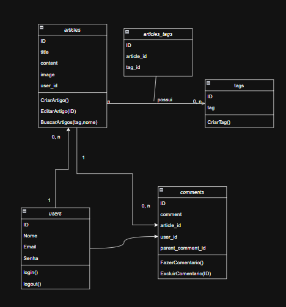

# Concepção do Projeto

Para criação do backend e entrega do MVP de forma ágil, foi estruturado o projeto para garantir  **simplicidade de manutenção** e **organização do código**.

## Decisões Técnicas

- **FastAPI**: Facilita a criação da API e gera automaticamente a documentação no Swagger da API
- **SQLAlchemy**: Utilizado como ORM, facilitando a comunicação entre código e banco de dados
- **PostgreSQL**: Banco de dados robusto e que trata concorrência caso a aplicação cresça
- **Arquitetura em Camadas**: Garante separação de responsabilidades, encapsulando as lógicas e facilitando a manutenção

> Para teste da implementação dos endpoints, foi utilizado o **Insomnia** para checar o funcionamento das requisições e respostas de modo mais rápido.

## Estrutura do backend

```bash
backend
├── .venv
├── app
│   ├── api             # Endpoints da API
│   ├── application     # Casos de uso e regras
│   ├── config          # Configuração geral da aplicação
│   ├── crud            # Arquivos para tratar e popular o banco
│   ├── data            # Arquivos com os dados iniciais
│   ├── domain          # Domínios da aplicação
│   ├── infrastructure  # Conexões externas
│   ├── schemas         # Modelos para validação
│   ├── tests           # Testes automatizados
│   ├── utils           # Funções utilitárias
│   └── main.py         # Chamada inicial da aplicação
├── .env
├── alembic.ini         # Configuração de migração
├── Dockerfile          # Configuração do container
└── requirements.txt    # Dependências do projeto
```

## Para estruturação do backend o projeto foi pensado do seguinte modo:



## Passos para construção do backend

### Passo 1. Estruturação mínima e teste de funcionamento:

- application: Contém os serviços para as entidades: Article, Comment, Tag e Users
- domain: Inclui os domínios da aplicação
- infrastructure:
    - models: Models da aplicação com a inclusão da tabela N para N do Article - Tag
    - repositories: Repositórios de cada Entidade
    - database.py: Acessa o banco de dados e cria a sessão
    - exceptions.py: Lançamento de Exceções
    - init_db.py: Limpeza do banco e recriação da base e tabelas
- schemas: Configuração das entidades para retorno nas requisições

### Passo 2. Criação do Dockerfile e docker-compose.yml

A partir daqui o FastAPI e o banco de dados com o PostgreSQL já estavam rodando nos containeres.

### Passo 3. Primeiro Caso de Uso

Foi desenvolvido o primeiro caso de uso **Criar Artigo**, passando inicialmente o author como uma propriedade e testando o preenchimento com Tags e sem Tags.

Testes feitos no Insomnia:

Com Tags:
```bash
{
	"title": "Teste do domingo 4",
	"content": "Teste de um novo artigo",
	"image": "teste",
	"tags": ["ccc", "ddd"]
}
```

e sem Tags
```bash
{
	"title": "Teste do domingo 4",
	"content": "Teste de um novo artigo",
	"image": "teste",
	"tags": []
}
```

### Passo 4. Criação dos demais casos de uso
Após fazer o primeiro caso de uso **Cadastrar Artigo**, foram desenvolvido os demais:
- Adicionar Comentário
- Remover Comentário
- Atualizar artigo
- Funções de filtro

> Obs.: Sempre realizando os testes no Insomnia

### Passo 5. Implementação do login
Foram criados:
- Funções para geração e validação de Token
- Injenção de Dependências para garantir a segurança dos endpoints

### Passo 6. Tratamento dos dados e preenchimento do banco de dados
Nesse último passo, foi realizado o seguinte:
- Criação do arquivo *migrate.py* na pasta **crud**
- Criação do arquivo *init_db.py* dentro da pasta **infrastructure**
- E por fim, foi feito a chamada a execulção do *migrate.py* na inicialização do container do FastAPI.


### Passo 7. Início da estruturação do frontend
Após deixar a API minimamente funcional, foi iniciado a estruturação do frontend

## Pontos de melhoria

- Inclusão dos testes unitários e de integração que não foram feitos

- Refatorar camadas, deixando o código mais limpo e retirando o código redundante

- Implementação do Alembic, permitindo fazer migrações de modo mais fácil